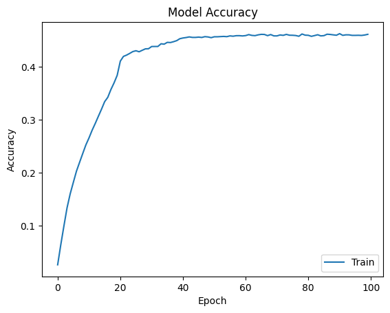

# AlexNet Paper Reproduction (2012)

## Introduction
This project reproduces the original AlexNet architecture as described in the paper.

## Architecture Summary
| Layer  | Type                | Filters | Kernel | Stride | Output Size         |
| ------ | ------------------- | ------- | ------ | ------ | ------------------- |
| Input  | —                   | 3       | —      | —      | 227×227×3           |
| Conv1  | Conv + ReLU         | 96      | 11×11  | 4      | 55×55×96            |
| Pool1  | MaxPool             | —       | 3×3    | 2      | 27×27×96            |
| LRN1   | Local Response Norm | —       | —      | —      | 27×27×96            |
| Conv2  | Conv + ReLU         | 256     | 5×5    | 1      | 27×27×256           |
| Pool2  | MaxPool             | —       | 3×3    | 2      | 13×13×256           |
| LRN2   | Local Response Norm | —       | —      | —      | 13×13×256           |
| Conv3  | Conv + ReLU         | 384     | 3×3    | 1      | 13×13×384           |
| Conv4  | Conv + ReLU         | 384     | 3×3    | 1      | 13×13×384           |
| Conv5  | Conv + ReLU         | 256     | 3×3    | 1      | 13×13×256           |
| Pool5  | MaxPool             | —       | 3×3    | 2      | 6×6×256             |
| FC6    | Dense + ReLU        | 4096    | —      | —      | 4096                |
| FC7    | Dense + ReLU        | 4096    | —      | —      | 4096                |
| Output | Dense + Softmax     | 200    | —      | —      | class probabilities |

## Dataset
tiny-imagenet-200 is used as the dataset in this reproduction, as ImageNet has too many training images and takes too long for training. Validation set is used as test set, as the actual test set is not labelled. Images are resized from 64×64 to 224×224 to match the original AlexNet input resolution.

## Reproduced Results
| Metric            | Value |
| ----------------- | ----- |
| Training accuracy | 45.70% |
| Test accuracy     | 34.03% |

## References
AlexNet (Original Paper)
Krizhevsky, A., Sutskever, I., & Hinton, G. E. (2012).
ImageNet Classification with Deep Convolutional Neural Networks.
In Advances in Neural Information Processing Systems (NeurIPS 2012), 25, 1097–1105.

Tiny ImageNet Dataset
Wu, J., Zhang, J., Xie, Y., & others. (2017).
Tiny ImageNet Visual Recognition Challenge.
Stanford University.
https://tiny-imagenet.herokuapp.com/
